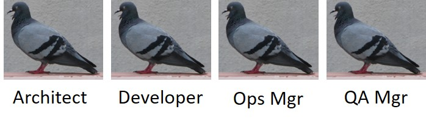

# Don't persona pigeon-hole users of your platform {#article-title}

## Brian Otten {#article-author}
## Digital Transformation Catalyst at Axway {#article-author-role}
### April 2, 2019 {#article-date}

### _Understand what they do and how to make their lives easier first_ {#article-tagline}

Here's a brutally honest bit of truth - telling me what you are or what your role is doesn’t help me as a trusted digital transformation advisor to help you make your life easier.

Telling me what you do on a daily basis and how that contributes to your organization’s value - now we’re getting somewhere.

Making your life easier translates into all the things we think of as business transformation - we transform because we want to be better.

Also - I’m not particularly interested in what you’re responsible for in your organization as much I am about what actions you take to make sure that you get the business value out of technology and that things get done on time.

And yet ...

... we still feel the need to somehow capture the definition of users of our technology platforms in a nice little cubby-hole. We put a name tag on that cubby and we describe the person inside with the behaviors and skills they possess and sometimes even the things for which they are responsible in an organization. 

I get why we are so hung up on personas. It's the same reason we are so hung up on user experience (UX) and user stories. As platform providers for digital transformation, it's critical that we make sure we understand groups of target users of our platform across the whole customer journey: from marketing to sales engagement and customer success right on through to product evolution and development. Tons of articles have been written on why personas are effective and great. Just as many have been published on why they fail and never get used after all the loving and empathetic work that has been poured into constructing them.

Recently, I was asked to write a white paper on personas for our platform. The first thing I wanted to do was understand what we as a company had done with persona development. My conclusion: we had done a tremendous amount of work in this area over the last year. Not only did we have a plethora of personas floating around out there but they were done by different teams with different objectives. 

Nine personas were created by a regional team focusing on _API First_ as a practice for our customers. Our R&D and Product team were managing no less that twenty personas within our product-management tooling. They seemed to be defined by a whole mishmash of things ranging from specific users of a component of the platform to those with a more financial responsibility in our customer base. One of them even was just labeled: "003695". Hey man, I'm a name, not a number!! 

Finally, I unearthed a different set of personas created by the team that ensures that we can derive valuable customer experience analytics and report back on that for coordinating cross-functional decisions around improving our Net Promoter Score (NPS). Release another 15 pigeons into the park.

So, I was able to dig around and find around 45 personas in a cursory investigation across our information repositories. I am sure there are even more out there. Although I now have a greater understanding of the types of people we're targeting for our platform, I don't think I'm all that much closer in answering that really interesting question of how is our platform making people's lives easier and what value it brings to our customers.

Personas then, are not enough. All is not lost though. Combined with another construct, they can do their job of helping us to be empathetic and understand the objectives, attitudes and behaviors of our users. This construct is known as _Job To Be Done_ (JTBD) and was developed as a lean framework by Clayton Christensen at Harvard Business School. JTBD focuses on job statements and outcome expectations. The cool thing about JTBD is that the job statements you define when working with your users get to the heart of their needs and not their solutions. When you understand how your platform matches needs, you understand how it can make their lives easier. 

Personas can assist in qualifying job statements in many cases, especially when used in combination with the _Job Story_. A Job Story improves upon the classic User Story by extending and enhancing it with the construct of the Job Statement from JTBD. The Job Story approach was developed by great design companies like [Intercom](https://www.intercom.com/blog/the-dribbblisation-of-design/).

Here's an example: a normal Job Story contains a Situation, a Motivation and an Expected Outcome and might look like this:

_When I start planning for a development sprint, I want to find existing APIs, so that I can avoid duplicating effort and reduce my sprint time_

That's pretty clear except I'm not really too sure who is supposed to be doing that. Is it one person that is going to get that job done? Who's involved? Who gets the benefit of the expected outcome? Let's modify it with some personas:

_When an API Product Manager starts planning for a development sprint, they want to find existing APIs, so that API Developers can avoid duplicating effort and help reduce the API Team's sprint times_

Now I can clearly see who is doing what in this job scenario, who triggers the job, who does work and who benefits. It's easy to envision building up a searchable catalog of Job Stories through this approach, so that different areas of the organization can work with their own definitions of personas, thereby liberating you from that user pigeon-holing and focusing directly on what your platform users really need. 

Revisit your personas and check out JTBD and Job Stories to really make them useful. Armed with JTBD and some customer-focused personas, you too can finally let those pigeons free!  

### Further reading
https://sloanreview.mit.edu/article/finding-the-right-job-for-your-product/
https://jtbd.info/replacing-the-user-story-with-the-job-story-af7cdee10c27
https://www.intercom.com/blog/the-dribbblisation-of-design/
https://customergauge.com/blog/how-to-calculate-the-net-promoter-score/